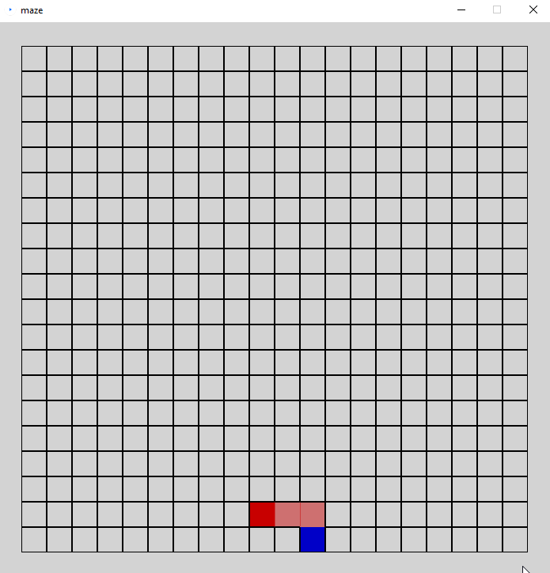

# Processing-Maze-Generator

A maze generator made with Processing.

This was a project I made in 2018 when I got inspired by [The Coding Train](https://www.youtube.com/@TheCodingTrain/videos) to work [Processing](https://processing.org/).

## What it does

1. The head of the generator (dark red tile) starts at a random point on the grid (blue tile).
2. It then chooses a random direction to go. This is repeated until there are no neighboring tiles left that haven't been visited (light red tiles).
3. If this is the case the head will move backwards until it reaches a tile with a neighboring tile that it hasn't visited yet. Any tile that visited while moving backwards is considered finished and is colored white.
4. Go back to step 2

## Example

